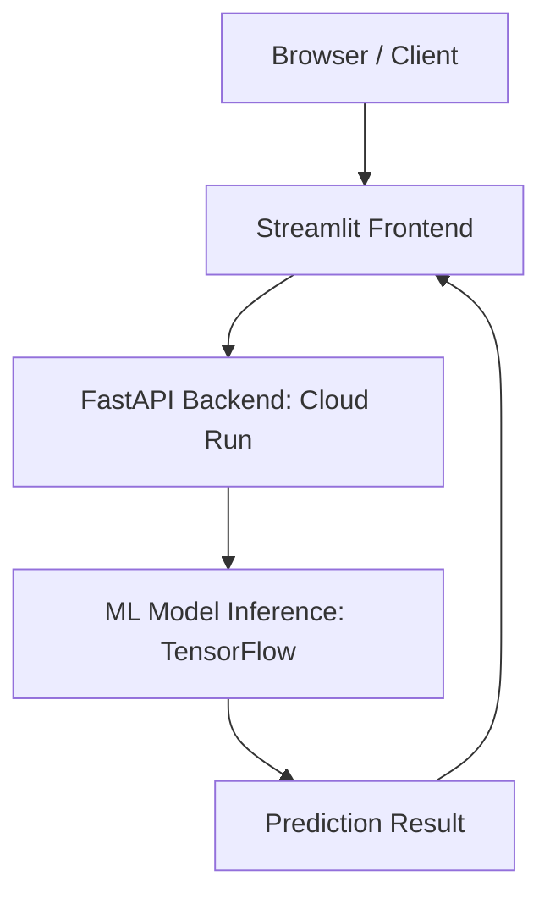

# 🌙 Lunar Crater Age Classifier

- **Description:** A machine learning model deployed via a scalable web API to classify lunar crater image chipouts into age categories (Fresh Crater, Old Crater, No Crater).
- **Data used:** LROCNet Moon Classifier Dataset ([Zenodo/source](https://zenodo.org/records/7041842))
- **Which API we're using:** FastAPI (for the ML service)
- **Where front-end can be accessed:** ([Streamlit Cloud](https://lunaralge.streamlit.app/))

### What's here:

* [Streamlit](https://docs.streamlit.io/) on the frontend
* [FastAPI](https://fastapi.tiangolo.com/) on the backend
* [PIL/pillow](https://pillow.readthedocs.io/en/stable/) and [opencv-python](https://github.com/opencv/opencv-python) for working with images
* Backend and frontend can be deployed with Docker

### Architecture

The prediction flow is structured as a scalable, serverless pipeline on Google Cloud Platform (GCP).


---

## 🛠️ Setup and Local Usage

### Project structure


### Setup instructions

Document here for users who want to setup the package locally

1.  **Clone the Repository:**
    ```bash
    git clone https://github.com/grcbrz/frontend-lunar-crater-age-classifier
    cd frontend-lunar-crater-age-classifier
    ```

2.  **Create and Activate Environment:**
    ```bash
    pyenv virtualenv 3.10.6 frontend-lunar-crater-age-classifier
    cd ~/code/<GITHUB_USER>/frontend-lunar-crater-age-classifier
    pyenv local frontend-lunar-crater-age-classifier
    ```

3. **Create the .python-version file:**
    ```bash
    # This file tells pyenv/direnv which Python environment to use
    echo "frontend-lunar-crater-age-classifier" > .python-version
    ```
4.  **Install Dependencies:**
    ```bash
    pip install -r requirements.txt
    ```

5.  **Configure Secrets:** Create the `.streamlit/secrets.toml` file with your Cloud Run backend URL:
    ```toml
    BACKEND_URL="[https://lunar-crater-737799387839.europe-west1.run.app](https://lunar-crater-737799387839.europe-west1.run.app)"
    ```

---

### 🔨 Makefile Commands

We use a `Makefile` to simplify common development tasks and ensure consistent execution across the team.

| Command | Description | Artifact/Service |
| :--- | :--- | :--- |
| `make install` | Installs all required Python dependencies. | Python Environment |
| `make streamlit` | Runs the Streamlit frontend locally. | Streamlit App |

**Example of use:**

```bash
# To install dependencies and run the frontend
make install
make streamlit
